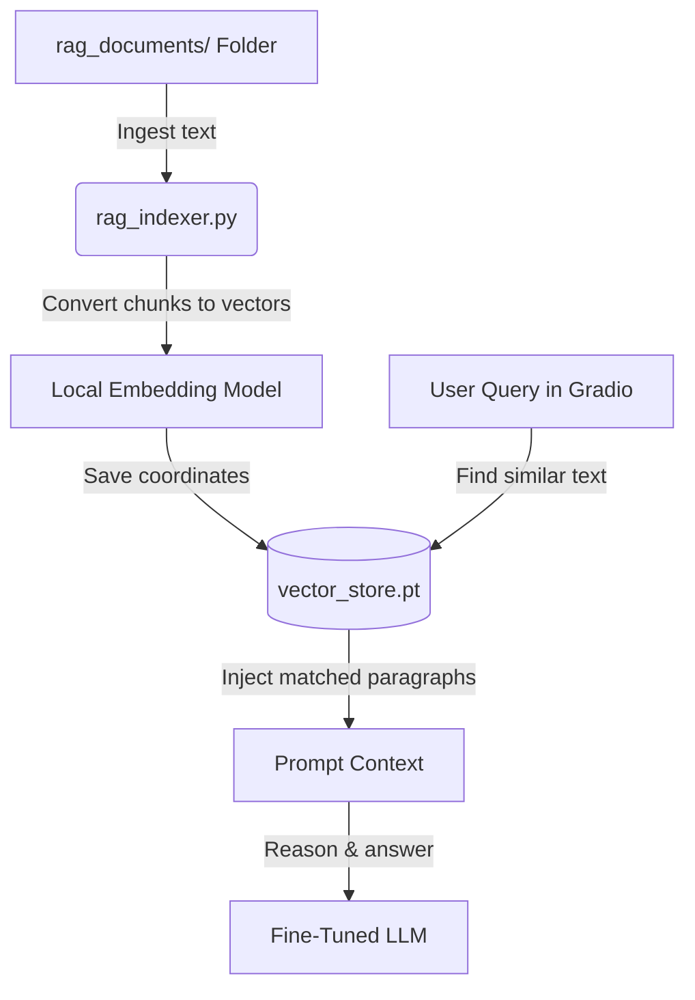

# 📖 How to Build a Local RAG (Retrieval-Augmented Generation) Chatbot

This guide explains the concepts and steps to build a local RAG pipeline to give your fine-tuned local chatbot access to custom, up-to-date facts and documents.

---

## 💡 Key Concept: Fine-Tuning vs. RAG

*   **Fine-Tuning (Teach *How* to Think):** Modifies the model's internal neural weights. We do this to teach the model a specific format, reasoning sequence (e.g., `Let's think. ... So, the answer is ...`), or conversation tone.
*   **RAG (Give *What* to Think About):** Leaves the model weights **completely unchanged**. Instead, it functions like an **open-book exam**. It retrieves relevant paragraphs from your text documents and inserts them into the model's system prompt in real-time.

---

## ⚙️ How the RAG System Works Locally

Everything runs 100% on your local computer (zero data leakage to the cloud):



### The Ingestion Phase (Done once, or whenever files change)
1.  **Drop Files:** Put text (`.txt`) or markdown (`.md`) files inside a folder called `rag_documents/`.
2.  **Chunking:** The ingestion script splits the text into small overlapping paragraphs.
3.  **Embeddings:** A tiny local embedding model (~30MB) converts those text chunks into mathematical coordinates (vectors).
4.  **Save Database:** The text chunks and their matching coordinates are saved locally to a file named `vector_store.pt`.

### The Retrieval Phase (Done on every message)
1.  **Vector Comparison:** When you ask the chatbot a question, the UI turns your question into vector numbers using the same small model.
2.  **Similarity Match:** It compares your question's numbers against all paragraphs in `vector_store.pt` (using fast cosine similarity) to find the closest matches.
3.  **Context Injection:** It joins the best matched paragraphs and inserts them into the model's prompt:
    ```text
    System: Use the following context to answer the user's question.
    Context: [Top retrieved paragraphs go here]
    
    User: [Your question]
    ```
4.  **Reasoning Answer:** The model reads the context, uses its fine-tuned reasoning to digest the facts, and returns the final answer.

---

## 🛠️ Step-by-Step Implementation Guide

Follow these steps in your powershell terminal to set up the database and run the chatbot with RAG.

### 📦 Step 1: Install sentence-transformers
Make sure your virtual environment is active, then run:
```powershell
python -m pip install sentence-transformers
```

---

### 📝 Step 2: Create the Ingestion Script (`rag_indexer.py`)
Create a file named `rag_indexer.py` at the root of your project and paste this script:

```python
import os
import torch
from sentence_transformers import SentenceTransformer

DOCS_DIR = "./rag_documents"
DB_PATH = "./vector_store.pt"
EMBEDDING_MODEL_ID = "sentence-transformers/all-MiniLM-L6-v2"

def chunk_text(text, max_chars=300):
    sentences = [s.strip() for s in text.replace("\n", " ").split(". ") if s.strip()]
    chunks = []
    current_chunk = []
    current_len = 0
    for sentence in sentences:
        sentence_len = len(sentence)
        if current_len + sentence_len > max_chars:
            if current_chunk:
                chunks.append(". ".join(current_chunk) + ".")
            current_chunk = [sentence]
            current_len = sentence_len
        else:
            current_chunk.append(sentence)
            current_len += sentence_len + 2
    if current_chunk:
        chunks.append(". ".join(current_chunk) + ".")
    return chunks

def build_index():
    if not os.path.exists(DOCS_DIR):
        os.makedirs(DOCS_DIR)
        print(f"Created folder: {DOCS_DIR}. Place your text (.txt/.md) documents here and re-run!")
        return

    files = [f for f in os.listdir(DOCS_DIR) if f.endswith((".txt", ".md"))]
    if not files:
        print("No documents found in rag_documents/. Ingestion aborted.")
        return
        
    print(f"Indexing files: {files}")
    all_chunks = []
    for file_name in files:
        file_path = os.path.join(DOCS_DIR, file_name)
        with open(file_path, "r", encoding="utf-8") as f:
            chunks = chunk_text(f.read())
            all_chunks.extend(chunks)

    print("Loading embedding model...")
    embedding_model = SentenceTransformer(EMBEDDING_MODEL_ID)
    embeddings = embedding_model.encode(all_chunks, convert_to_tensor=True)
    
    torch.save({
        "chunks": all_chunks,
        "embeddings": embeddings.cpu()
    }, DB_PATH)
    print(f"🎉 Success! Database saved locally to: {DB_PATH}")

if __name__ == "__main__":
    build_index()
```

---

### 📝 Step 3: Update the Chatbot Script (`ui_finetuned_opensource.py`)
Replace your `ui_finetuned_opensource.py` script content with the updated code below (which automatically integrates RAG database lookup):

```python
import os
import torch
from transformers import AutoModelForCausalLM, AutoTokenizer
from peft import PeftModel
from sentence_transformers import SentenceTransformer
import gradio as gr

# Configure model IDs
base_model_id = "Qwen/Qwen2.5-1.5B-Instruct"  # Change to "meta-llama/Llama-3.2-1B-Instruct" if switching
adapter_dir = "./local_finetuned_model"
DB_PATH = "./vector_store.pt"
EMBEDDING_MODEL_ID = "sentence-transformers/all-MiniLM-L6-v2"

print("=== Loading Tokenizer & 16-bit Base Model ===")
tokenizer = AutoTokenizer.from_pretrained(base_model_id)
base_model = AutoModelForCausalLM.from_pretrained(
    base_model_id,
    torch_dtype=torch.float16,
    device_map="auto"
)

print("=== Merging Fine-Tuned LoRA Adapters ===")
model = PeftModel.from_pretrained(base_model, adapter_dir)
print("Model loaded and merged successfully!")

# Load RAG Ingestion elements if database is built
print("=== Loading RAG Embedding Model ===")
embedding_model = SentenceTransformer(EMBEDDING_MODEL_ID)

vector_db = None
if os.path.exists(DB_PATH):
    print("=== Loading local vector database ===")
    vector_db = torch.load(DB_PATH)
else:
    print("=== No local database found. Chatbot is running without RAG! ===")

# Keep a history of the FULL raw model responses
full_responses = []

def predict(message, history):
    global full_responses, vector_db
    
    if len(history) == 0:
        full_responses = []
        
    messages = []
    
    def clean_text(content):
        if not content:
            return ""
        if isinstance(content, str):
            return content
        if isinstance(content, dict):
            return content.get("text", content.get("content", ""))
        if isinstance(content, list):
            parts = []
            for item in content:
                if isinstance(item, str):
                    parts.append(item)
                elif isinstance(item, dict):
                    parts.append(item.get("text", item.get("content", "")))
                elif hasattr(item, "text"):
                    parts.append(getattr(item, "text", ""))
            return "".join(parts)
        return str(content)

    # 1. RAG Search (Cosine similarity)
    context = ""
    user_text = clean_text(message)
    if vector_db is not None and user_text.strip():
        # Encode user query
        query_vec = embedding_model.encode(user_text, convert_to_tensor=True).cpu()
        db_vecs = vector_db["embeddings"]
        
        # Calculate cosine similarities (dot product since vectors are normalized)
        similarities = torch.matmul(db_vecs, query_vec)
        
        # Retrieve top 2 matches
        top_k = min(2, len(similarities))
        top_indices = torch.topk(similarities, k=top_k).indices.tolist()
        
        retrieved_chunks = [vector_db["chunks"][idx] for idx in top_indices]
        context = " ".join(retrieved_chunks)
        print(f"\n[RAG] Retrieved matching context:\n{context}\n")

    # 2. Build history messages list
    for idx, msg in enumerate(history):
        if isinstance(msg, dict):
            role = msg.get("role", "user")
        elif hasattr(msg, "role"):
            role = getattr(msg, "role", "user")
        else:
            role = "user" if idx % 2 == 0 else "assistant"
            
        if role == "assistant" and (idx // 2) < len(full_responses):
            content = full_responses[idx // 2]
        else:
            if isinstance(msg, dict):
                content = clean_text(msg.get("content", ""))
            elif hasattr(msg, "content"):
                content = clean_text(getattr(msg, "content", ""))
            elif isinstance(msg, (list, tuple)) and len(msg) == 2:
                content = clean_text(msg[1] if role == "assistant" else msg[0])
            else:
                content = clean_text(msg)
                
        messages.append({"role": role, "content": content})
    
    # Prepend retrieved context if available
    final_user_content = user_text
    if context:
        final_user_content = f"Context:\n{context}\n\nQuestion: {final_user_content}"
        
    messages.append({"role": "user", "content": final_user_content})
    
    # Generate response
    prompt = tokenizer.apply_chat_template(messages, tokenize=False, add_generation_prompt=True)
    inputs = tokenizer(prompt, return_tensors="pt").to("cuda")
    
    with torch.no_grad():
        outputs = model.generate(
            **inputs,
            max_new_tokens=512,
            temperature=0.7,
            top_p=0.9,
            repetition_penalty=1.1,
            eos_token_id=tokenizer.eos_token_id
        )
    
    generated_ids = [
        output_ids[len(input_ids):] for input_ids, output_ids in zip(inputs.input_ids, outputs)
    ]
    response = tokenizer.decode(generated_ids[0], skip_special_tokens=True).strip()
    full_responses.append(response)
    
    # Extract clean final answer (Hiding internal thinking)
    lower_res = response.lower()
    marker = "the answer is"
    
    if marker in lower_res:
        idx = lower_res.find(marker)
        return response[idx + len(marker):].strip(" :,.\n")
            
    cleaned = response
    think_marker = "let's think."
    if cleaned.lower().startswith(think_marker):
        cleaned = cleaned[len(think_marker):].strip(" :,.\n")
        
    return cleaned

demo = gr.ChatInterface(
    fn=predict,
    title="🧠 Local Fine-Tuned Chatbot (Gradio UI)",
    description="Chat with your locally fine-tuned Llama/Qwen reasoning model. The interface keeps track of your conversation history.",
    examples=["What has keys but can't open locks?", "What is 15 + 27?", "Write a poem about rain."]
)

if __name__ == "__main__":
    demo.launch(share=False)
```

---

### 🏃 Step 4: Add Custom Documents and Run

To run it yourself:
1.  Create a folder `rag_documents/` at the root of your project if it doesn't exist yet.
2.  Put any `.txt` or `.md` files containing your custom/recent data inside `rag_documents/`.
3.  Run the indexer to compile your vector database:
    ```powershell
    python rag_indexer.py
    ```
4.  Launch the Web UI chatbot:
    ```powershell
    python ui_finetuned_opensource.py
    ```
5.  Ask questions about the custom documents inside the browser to see RAG in action!

