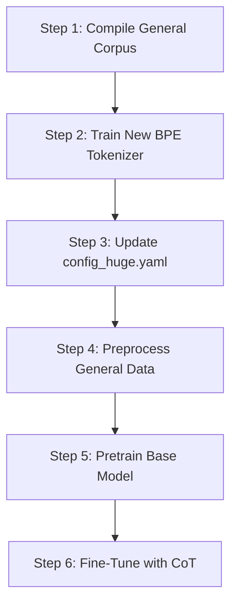

# Guide to Pretraining Your General Base Model From Scratch

This guide details how to build and train your own custom **General Base Model** (124M Parameters, GPT-2 Small equivalent) from scratch using a general-knowledge text corpus (covering basic science, geography, math examples, and python code).

By following this guide, your model will gain the vocabulary and semantic foundation required to solve general questions (like arithmetic and coding) before we apply Chain-of-Thought (CoT) reasoning.

---

## Step-by-Step Implementation Workflow



---

## Step 1: Compile a General Knowledge Corpus
To train a model that understands math, logic, and code, we must replace the storytelling dataset with a general-purpose text file.

1.  Create a large text file: `data/raw/huge_corpus_general.txt`.
2.  Populate it with a diverse blend of:
    *   **General Facts:** Short Wikipedia extracts about geography, space, countries, and capitals.
    *   **Basic Arithmetic:** Sentences representing equations:
        *   `1 plus 1 equals 2.`
        *   `2 multiplied by 3 is 6.`
    *   **Python Code:** Simple code blocks (defining functions, print statements, loops) so the model learns characters like `(`, `)`, `:`, and python keywords (`def`, `print`, `for`).
    *   **Conversational Dialogues:** Standard chats and greetings.
To generate the corpus run this command in your terminal:

```powershell 
  python scripts/download_general_corpus.py
```
*(Target file size: at least 30MB to 50MB of raw text for best results on home GPUs).*

---

## Step 2: Train a New BPE Tokenizer
Because a general corpus contains characters and words not present in children's stories (like mathematical operators `+`, `-`, and code punctuation), you must train a new tokenizer with a larger vocabulary.

Run this command in your terminal:
```powershell
python -m tokenizer.train_tokenizer --type bpe --vocab_size 16384 --raw_data_path data/raw/huge_corpus_general.txt --tokenizer_dir data/tokenizer_general
```
The script will ignore whatever is in the config file and directly use the settings you passed in the terminal. So you can run Step 2 immediately without changing the config first!

or

```powershell
python -m tokenizer.train_tokenizer --config configs/config_huge.yaml
```
after updating the config file run this command. If you do this, the script will automatically read all paths and the 16384 vocab size directly from the config file!

*   `--vocab_size 16384`: Expands the BPE dictionary to 16k tokens so it can represent coding structures and math terms efficiently.
*   `--tokenizer_dir data/tokenizer_general`: Saves the new vocabulary definitions in a separate folder.

---

## Step 3: Update `configs/config_huge.yaml`
Modify your YAML configuration file to point to your new tokenizer and general dataset paths:

```yaml
model:
  vocab_size: 16384        # Must match the target vocab size of your BPE tokenizer
  block_size: 512         # Context window
  n_layer: 12             # 12 Transformer blocks
  n_head: 12              # 12 Attention heads
  n_embd: 768             # 768 Embedding dimension

data:
  raw_data_path: "data/raw/huge_corpus_general.txt"
  processed_dir: "data/processed"
  tokenizer_dir: "data/tokenizer_general"  # Point to your new tokenizer folder
```

---

## Step 4: Preprocess the General Dataset
Convert the raw text into binary token arrays for fast loading during training:

```powershell
python -m training.dataset --config configs/config_huge.yaml
```
This reads the new general corpus, tokenizes it with the 16k tokenizer, and saves the binary files (`train.bin` and `val.bin`) to `data/processed/`.

---

## Step 5: Start Pretraining Your Base Model
Now, train the model to learn the basics of language, math, and code:

```powershell
python -m training.train --config configs/config_huge.yaml
```
*   **GPU Load:** This will run your RTX 4060 Ti at 100% capacity.
*   **Training Time:** Pretraining on a 30MB-50MB corpus for 3 epochs with a 16k vocab will take **approximately 8 to 15 hours** to reach a low validation loss.
*   **Result:** Once finished, it will save the base weights to `experiments/checkpoints/best_model.pt`.

---

## Intermediate Step: Run and Test the Pretrained Base Model
Before fine-tuning, you should check how the base model completes sentences. Since this is a **base model** (and not a chatbot yet), do **not** use the `"Prompt: ... Response:"` template. Instead, just write natural sentence beginnings:

```powershell
python generate.py --checkpoint experiments/checkpoints/best_model.pt --tokenizer_dir data/tokenizer_general --prompt "Japan is a country in"
```

Try testing with other prompts like:
*   `"Python is a programming language that"`
*   `"Water has a chemical formula of"`

Observe how the base model tries to autocomplete the sentences naturally using what it learned from Wikipedia!

---

## Step 6: Fine-Tune with Chain-of-Thought (CoT)
Once the base model has learned how math and code look, we apply instruction tuning to give it the habit of thinking:

1.  **Generate Reasoning Dataset:**
    Run the reasoning script to create your dataset of Q&A reasoning examples:
    ```powershell
    python scripts/generate_reasoning_dataset.py
    ```
2.  **Run Preprocessor:**
    ```powershell
    python -m training.finetune_dataset --config configs/config_huge.yaml
    ```
3.  **Run Fine-Tuning:**
    ```powershell
    python -m training.finetune --config configs/config_huge.yaml
    ```
4.  **Test Reasoning:**
    ```powershell
    python generate.py --checkpoint 
    /checkpoints/instruct_model.pt --prompt "Prompt: What is 1 + 1?\nResponse:"
    ```

Because your base model now has mathematical facts in its brain from Step 5, when it generates `"Let's think. 1 + 1 means..."` it will successfully complete the math logic and output `2`!
