# 🧠 Mini GPT: Implementation Workflow & Architectural Mindmap

Here is a simple, visual guide explaining how our custom-built Mini GPT model operates, how it translates raw text into language, and how the entire pipeline works.

---

## ⚡ TL;DR: The 30-Second Summary
Building a GPT model from scratch involves three main stages:
1. **The Translation Stage (Tokenizer & Preprocessing)**: Turning human words into lists of numbers (Tokens) and saving them efficiently.
2. **The Learning Stage (The Neural Network Architecture)**: Passing those numbers through layers of custom-built neural math to predict what number (word) should come next.
3. **The Speaking Stage (FastAPI Server & Web UI)**: Running the trained model, controlling how creative it is with knobs (sliders), and typing out the text live in the browser.

---

## 🛠️ How We Built the Custom Model Code (From Scratch)

We did not use pre-built black-box transformer libraries. Instead, we wrote every mathematical operation using fundamental PyTorch tensor blocks. Here is a step-by-step breakdown of how each module was constructed and what it does:

---

### Step 1: Model Configurations (`model/config.py`)
* **Why we need it**: A deep learning model has many "knobs" (hyperparameters)—like the number of layers, number of attention heads, context window size, and embedding dimension size. If these are hardcoded, experimenting is slow and error-prone.
* **What it does**: Holds structural shape dimensions ($L$ layers, $H$ heads, $C$ channel dimensions, vocabulary size, and sequence length).
* **How the code works**:
  1. We defined a strict template using `Pydantic` models (`ModelConfig`, `TrainingConfig`, `DataConfig`).
  2. The configuration is read from a YAML file (like `configs/config.yaml`). Pydantic checks that no values are negative or out of bounds (e.g. attention heads must divide embedding dimensions evenly).

---

### Step 2: Embedding Layers (`model/embedding.py`)
* **Why we need it**: Computers don't understand words; they understand numbers. Furthermore, they need to know both *what* a word is, and *where* it is located in the sentence.
* **What it does**: Turns word indexes into rich vectors (lists of floats) and injects sequence order.
* **How the code works**:
  1. **Token Embedding (`GPTTokenEmbedding`)**: Creates a lookup table of shape `(VocabSize, C)`. If the input word index is `45`, it looks up the 45th vector in the table, returning a list of numbers representing that word's meaning.
  2. **Positional Embedding (`GPTPositionalEmbedding`)**: Creates a lookup table of shape `(MaxSequenceLength, C)`. It looks up a vector for each position index (e.g. index `0` for the first word, index `1` for the second) to represent *where* the word is in the sequence.
  3. **Combination**: The token vector and positional vector are added together:
     $$\text{Combined Embedding} = \text{Token Embedding} + \text{Positional Embedding}$$
     This single vector now contains both the word's meaning and its position in the sentence.

---

### Step 3: Custom Layer Normalization (`model/layernorm.py`)
* **Why we need it**: As data travels through deep networks, the numbers can compound and grow extremely large or shrink to zero. Normalization keeps the data balanced.
* **What it does**: Calibrates tensor values to have a mean of $0$ and standard deviation of $1$.
* **How the code works**:
  1. For each word vector, calculate its average value ($\mu$) and variance ($\sigma^2$) across the channel dimension.
  2. Normalize the vector: subtract the mean and divide by the square root of the variance plus a tiny number ($\epsilon$) to avoid division by zero:
     $$\hat{x} = \frac{x - \mu}{\sqrt{\sigma^2 + \epsilon}}$$
  3. Scale and shift the normalized vector by multiplying by a learnable weight ($\gamma$) and adding a learnable bias ($\beta$):
     $$\text{Output} = \gamma \hat{x} + \beta$$
  4. Supports disabling the bias parameter ($\beta$) to prevent overfitting (a technique used in state-of-the-art models like LLaMA).

---

### Step 4: Custom Multi-Head Causal Self-Attention (`model/attention.py`)
* **Why we need it**: In a sentence, the meaning of a word depends on the words around it. Attention is the mechanism that allows words to "talk" to each other and gather context.
* **What it does**: Calculates how much focus (attention) each word should place on every other word in the sentence.
* **How the code works**:
  1. **Linear Projection**: Multiply the input by a linear weight matrix to generate Query ($Q$), Key ($K$), and Value ($V$) vectors.
     * *Query ($Q$)*: What this word is looking for.
     * *Key ($K$)*: What this word offers.
     * *Value ($V$)*: The actual content of the word.
  2. **Multi-Head Split**: Split the vectors into $H$ heads (sub-spaces) so different heads can focus on different aspects (e.g., one head links nouns to adjectives, another links verbs to subjects).
  3. **Score Matrix Calculation**: Perform a matrix multiplication of Query and Key, and scale it by the square root of the head size:
     $$\text{Raw Scores} = \frac{Q K^T}{\sqrt{\text{HeadSize}}}$$
  4. **Causal Masking**: Because this is a predictive text model, it must not "read the future". We create a lower-triangular mask of ones. Where the mask is $0$, we overwrite the raw score with $-\infty$. When passed through `softmax`, these future coordinates become $0\%$ probability, blocking the model from looking ahead.
  5. **Context Aggregation**: Multiply the attention probabilities by the Value ($V$) matrix. Concatenate all heads back together and project through a final output layer (`c_proj`).

---

### Step 5: Custom FeedForward Layer (`model/feedforward.py`)
* **Why we need it**: Attention allows words to exchange context. The FeedForward layer allows each word to process that context individually and think about what it means.
* **What it does**: Applies a multi-layer perceptron (MLP) mapping vectors to a higher-dimensional space and back.
* **How the code works**:
  1. Expand the representation: project the tensor from dimension $C$ to a wider dimension $4 \times C$ using a linear layer.
  2. Apply the **GELU (Gaussian Error Linear Unit)** activation function to allow the model to learn non-linear patterns.
  3. Shrink the representation: project the tensor back from $4 \times C \to C$ using another linear layer.
  4. Apply dropout to prevent the model from memorizing the dataset (overfitting).

---

### Step 6: Assembling the Transformer Block (`model/transformer_block.py`)
* **Why we need it**: A single block performs attention and thinking once. We need to bundle these operations so we can stack them multiple times.
* **What it does**: Combines LayerNorm, Attention, and FeedForward MLP with residual (skip) connections.
* **How the code works**:
  1. Apply **Pre-LayerNorm**: We normalize the data *before* it goes into the attention layer and *before* it goes into the MLP layer.
  2. **Self-Attention Branch**: Pass normalized data to the attention layer, then add the original input back (a **residual shortcut**):
     $$x_{temp} = x + \text{Attention}(\text{LayerNorm}_1(x))$$
  3. **FeedForward Branch**: Pass $x_{temp}$ to the MLP layer, then add $x_{temp}$ back (second shortcut):
     $$x_{out} = x_{temp} + \text{MLP}(\text{LayerNorm}_2(x_{temp}))$$
  * *Why the shortcuts?* Residual paths provide a direct highway for gradients to flow backward during training. Without them, deep models (with e.g. 12+ blocks) fail to train because gradients vanish.

---

### Step 7: Full Model Orchestration (`model/gpt.py`)
* **Why we need it**: This wraps all the stacked transformer blocks together, handles the token input, and produces output words.
* **What it does**: Feeds tokens through embeddings and transformer layers, then predicts next-word probabilities.
* **How the code works**:
  1. **Embeddings & Stack**: Send input tokens through token & positional embeddings, then loop through the stack of $L$ Transformer Blocks.
  2. **Language Modeling Head**: Project the final vectors through a linear layer (`lm_head`) to map them to vocabulary scores (logits).
  3. **Weight-Tying**: Bind the weights of the input token embedding and the output classification head together:
     ```python
     self.lm_head.weight = self.transformer.wte.embedding.weight
     ```
     This reduces parameter size by 30% and keeps the model representation symmetric.
  4. **Scaled Initialization**: Initialize all weights using normal distributions ($\sigma = 0.02$). For weights inside residual projections, scale the initialization standard deviation by $1/\sqrt{2 \times \text{n\_layer}}$ so that activations don't blow up as the model gets deeper.
  5. **Autoregressive Generation**: Slices context window lengths, computes probabilities, applies **temperature scaling** (higher = more creative/random) and **Top-K filtering** (keeps only the top $K$ most likely words), samples a token using `torch.multinomial`, appends it to the prompt, and repeats.

---

## 🗺️ High-Level Project Pipeline Workflow

```mermaid
graph TD
    subgraph A[1. Data Prep: Turning Words into Numbers]
        A1[Raw text: input.txt] --> A2[train_tokenizer.py]
        A2 -->|Creates Dictionary| A3[tokenizer.json]
        A1 & A3 --> A4[dataset.py Preprocessing]
        A4 -->|Saves encoded files| A5[train.bin & val.bin]
    end

    subgraph B[2. The Model: Predicting the Next Word]
        B1[Input IDs: Batch, Sequence length] --> B2[Embeddings: Words + Positions]
        B2 -->|Tensors| B3[Transformer Blocks x L]
        subgraph Block[Inside a Transformer Block]
            B3 --> BlockLN1[LayerNorm: Keeps numbers stable]
            BlockLN1 --> BlockMHA[Attention: Links words together]
            BlockMHA --> BlockAdd1[Residual Connection: Fast pathway]
            BlockAdd1 --> BlockLN2[LayerNorm 2]
            BlockLN2 --> BlockFFN[FeedForward: Model thinks about words]
            BlockFFN --> BlockAdd2[Residual Connection 2]
        end
        BlockAdd2 --> B4[Final Normalization]
        B4 --> B5[LM Head: Turns thinking back to words]
        B5 -->|Word Probabilities| B6[Cross Entropy Loss]
    end

    subgraph C[3. The Training Loop: Learning by Trial]
        C1[AdamW Optimizer: Tweaks weights] --> C2[Trainer Loop trainer.py]
        C3[LR Scheduler: Lowers learning rate] --> C2
        A5 -->|Load binary data slices| C2
        C2 -->|Saves best model| C4[best_model.pt Checkpoint]
    end

    subgraph D[4. Instruction Fine-Tuning (SFT)]
        C4 --> D1[Load best_model.pt]
        D2[Q&A Dataset qa_dataset.json] --> D3[Pad Sequences finetune_dataset.py]
        D1 & D3 --> D4[Trainer Loop finetune.py]
        D4 -->|Saves instruct model| D5[instruct_model.pt Checkpoint]
    end

    subgraph E[5. Deployment: Interactive UI]
        D5 & A3 --> E1[FastAPI Server main.py]
        E1 -->|Serves Web Page| E2[Interactive HTML Playground UI]
        E1 -->|API Endpoint| E3[/generate API]
        E2 & E3 -->|Runs generation| E4[generate.py CLI Pipeline]
        E4 -->|Creative sampling| E5[Temperature / Top-K]
    end

    style A fill:#1e1b4b,stroke:#4f46e5,stroke-width:2px,color:#fff
    style B fill:#311042,stroke:#a855f7,stroke-width:2px,color:#fff
    style C fill:#062f4f,stroke:#0ea5e9,stroke-width:2px,color:#fff
    style D fill:#4a044e,stroke:#d946ef,stroke-width:2px,color:#fff
    style E fill:#064e3b,stroke:#10b981,stroke-width:2px,color:#fff
```

---

## 🔍 How Data Flows Through the Model (Tensor Shapes)

* **B (Batch)**: The number of sentences we process at the same time.
* **T (Time / Sequence Length)**: The number of tokens (words) in each sentence.
* **C (Channels / Embedding Dimension)**: The detail size of each word's representation.

```mermaid
graph TD
    In["Input Sequence IDs<br/>Shape: (B, T)<br/>Example: [ [12, 45, 9, 3] ]"] --> TokenEmb["Token Embedding (WTE)<br/>Transforms IDs into vectors<br/>Shape: (B, T, C)"]
    In --> PosEmb["Positional Embedding (WPE)<br/>Adds position vectors<br/>Shape: (1, T, C)"]
    
    TokenEmb & PosEmb --> AddEmb["Combine Embeddings + Dropout<br/>Shape: (B, T, C)"]
    
    AddEmb --> LN1["LayerNorm 1<br/>Balances out values<br/>Shape: (B, T, C)"]
    
    LN1 --> QKV["QKV Projection<br/>Calculates Query, Key, and Value<br/>Shape: (B, T, 3*C)"]
    QKV --> Split["Split Attention Heads<br/>Shape: (B, NumHeads, T, HeadSize)"]
    
    Split --> MatMul["Compute Relationship Matrix<br/>(Q @ K.T)<br/>Shape: (B, NumHeads, T, T)"]
    MatMul --> Mask["Causal Masking<br/>Block future words<br/>Shape: (B, NumHeads, T, T)"]
    Mask --> Softmax["Softmax Probability Weighting<br/>Shape: (B, NumHeads, T, T)"]
    Softmax --> AttnOut["Combine Weightings with Values<br/>Shape: (B, NumHeads, T, HeadSize)"]
    
    AttnOut --> Concat["Merge Attention Heads back together<br/>Shape: (B, T, C)"]
    Concat --> OutProj["Project back to base channel size<br/>Shape: (B, T, C)"]
    
    OutProj & AddEmb --> AddResidual1["Add Input back (Residual Shortcut)<br/>Shape: (B, T, C)"]
    
    AddResidual1 --> LN2["LayerNorm 2<br/>Shape: (B, T, C)"]
    
    LN2 --> MLP1["Linear Layer 1 (FC)<br/>Expand representation size<br/>Shape: (B, T, 4*C)"]
    MLP1 --> Act["GELU Activation<br/>Smooth non-linear reasoning<br/>Shape: (B, T, 4*C)"]
    Act --> MLP2["Linear Layer 2 (Proj)<br/>Shrink back to base channel size<br/>Shape: (B, T, C)"]
    
    MLP2 & AddResidual1 --> AddResidual2["Add Shortcut (Residual 2)<br/>Shape: (B, T, C)"]
    
    AddResidual2 -->|Pass to next layer block| Loop["Transformer Block x L"]
    
    AddResidual2 -.->|All blocks finished| FinalLN["Final LayerNorm<br/>Shape: (B, T, C)"]
    FinalLN --> LMHead["LM Head Linear Layer<br/>Projects back to vocabulary size<br/>Shape: (B, T, VocabSize)"]
    LMHead --> Logits["Output Logits<br/>Final word scores<br/>Shape: (B, T, VocabSize)"]

    %% Custom styling for variable list
    classDef varClass fill:#111827,stroke:#374151,stroke-width:1px,color:#9ca3af;
    class In,TokenEmb,PosEmb,AddEmb,LN1,QKV,Split,MatMul,Mask,Softmax,AttnOut,Concat,OutProj,AddResidual1,LN2,MLP1,Act,MLP2,AddResidual2,FinalLN,LMHead,Logits varClass;
```


